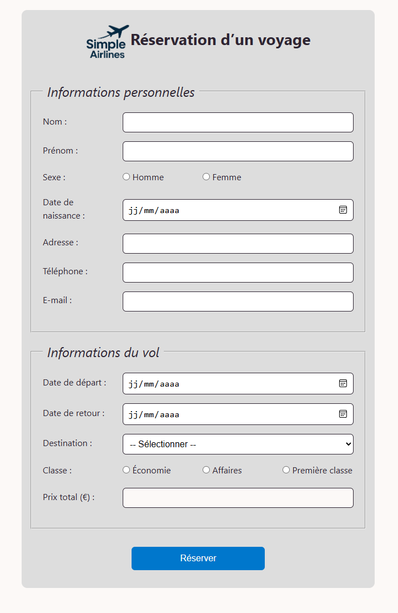

# ✈️ Simple Airlines — Réservation en ligne

Bienvenue sur le projet *Simple Airlines*, une application de réservation de vols en ligne incluant :
- un **formulaire de réservation** passager,
- un **formulaire de paiement**,
- un **récapitulatif** des informations de vol.

Ce projet a été réalisé par une équipe de 4 développeurs juniors dans le cadre de la formation JavaScript/TypeScript proposée par **Simplonline Grenoble**.

---

## 🎯 Objectif pédagogique

L’objectif était de concevoir une application web intégrant :
- La manipulation du DOM en TypeScript
- La structuration des données via des interfaces
- La validation dynamique des formulaires (regex, contraintes)
- Une architecture modulaire orientée objets
- L’utilisation d'un pattern **Factory**

---

## 🚀 Fonctionnalités

- 📄 Formulaire de réservation : saisie des données personnelles et du vol
- 💳 Paiement : vérification du type de carte et validation du numéro via algorithme Luhn
- 🧾 Récapitulatif : affichage structuré des données de réservation avec un numéro de réservation généré aléatoirement
- 🛠 Architecture intégrant différentes classes (Économique, Affaires, Première classe)

---

## 🛠️ Technologies utilisées

- VSCode
- Git / GitHub
- HTML5 / CSS3 / TypeScript